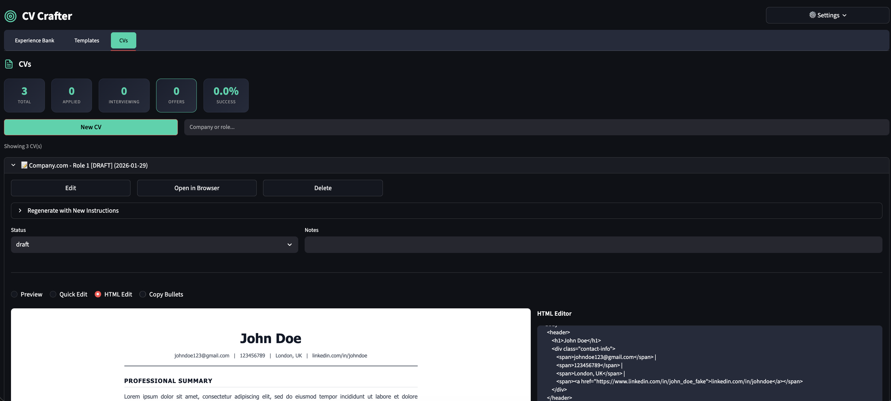

# 🎯 CV Crafter

**AI-Powered CV Generator** — A local tool for creating machine-readable, ATS-friendly CVs with Gemini and Claude AI assistance using your own API key. All data is stored locally. This is a spec-driven development project.


---

## 📸 Screenshot



---

## ✨ Features

- **✨ Unified CV Management** — Create, view, edit, and track all your CVs in one central hub
  - **Drawer-Based Editing** — Context-aware editing panel for CV creation and regeneration
  - **Full-Width Previews** — View your CVs in high-fidelity right in the app
  - **4 View Modes** — Preview, Quick Edit (Side-by-Side), HTML Edit, and Copy Bullets
- **📝 Experience Bank** — Store all your work experiences, education, skills, and projects in one place
  - Full CRUD: Add, Edit, Delete for all entry types
  - Toast notifications for instant feedback
- **🎨 Template Editor** — Create and customize CV templates with AI assistance
  - 3 built-in templates: Classic Professional, Modern Clean, Career Progression
- **🤖 Multi-AI Support** — Works with both Google Gemini and Anthropic Claude
- **🔒 Local-First** — All data stored locally, API key never saved to disk
- **🚀 One-Command Setup** — Download, run, done!

---

## 🚀 Quick Start

### Step 1: Download

**Option A: Git Clone**
```bash
git clone https://github.com/orajb/cv_craft.git
cd cv_craft
```

**Option B: Download ZIP**
1. Click the green **Code** button on GitHub
2. Select **Download ZIP**
3. Extract the folder

### Step 2: Run

**Easiest (any OS):**
```bash
python start.py
```

**macOS/Linux:**
```bash
./run.sh
```

**Windows:**
```
Double-click run.bat
```

That's it! The launcher automatically:
- ✓ Creates a virtual environment
- ✓ Installs all dependencies  
- ✓ Launches the app at `http://localhost:8501`

### Step 3: Get an API Key

You need ONE of these (not both):
- **Gemini API Key** — [Get free](https://makersuite.google.com/app/apikey)
- **Claude API Key** — [Get from Anthropic](https://console.anthropic.com/)

### First-Time Setup

1. **Click the ⚙️ Gear icon** in the top right
2. **Enter your API key** in the Settings popup
3. **Click "Test Connection"** to verify it works
4. **Go to Experience Bank** and add your information
5. **Go to CVs tab** and click **"+ New CV"** to create your first CV!

---

## 📖 Usage Guide

### Experience Bank

Store all your professional information:
- **Contact Info** — Name, email, phone, LinkedIn, GitHub
- **Work Experience** — Companies, roles, dates, bullet points
- **Education** — Degrees, institutions, highlights
- **Skills** — Technical, soft skills, tools, languages
- **Projects** — Personal/professional projects with tech stack
- **Certifications** — Professional certifications

> 💡 **Tip**: Add ALL your experiences here. The AI will select the most relevant ones for each job application.

### Unified CVs Tab

The heart of the application. Manage your CVs and applications in one place:

- **Create New CV**: Click **"+ New CV"** to open the creation drawer.
- **Drawer Editing**: Enter job details, select a template, and generate logic all in the side panel.
- **View Modes**:
  - **Preview**: Rendered CV as it will appear in PDF.
  - **Quick Edit**: Side-by-side view with Preview on left and Bullet Point editor on right.
  - **HTML Edit**: Full HTML source editor for fine-grained control.
  - **Copy Bullets**: Extract just the bullet points for online application forms.
- **Regenerate**: Update instructions and regenerate specific CVs without losing context.
- **Track Status**: Update application status (Created, Applied, Interviewing, Offer).

### Template Editor

Create and manage CV templates:
- **Generate with AI** — Describe your desired style and let Gemini create a template
- **Edit HTML** — Directly modify the template code
- **Preview** — See how the template looks with your data

---

## 🖨️ Exporting to PDF

The app uses browser-based PDF export for maximum ATS compatibility:

1. Click **"Open in Browser"** on any CV
2. Press `Cmd+P` (Mac) or `Ctrl+P` (Windows)
3. Select **"Save as PDF"**
4. Adjust margins if needed (usually 0.5in works well)

---

## 🔧 Configuration

### Models Used

| Task | Model | Fallback |
|------|-------|----------|
| CV Generation | `gemini-3-pro-preview` | `gemini-2.5-pro` |
| Template Generation | `gemini-2.0-flash` | — |
| Connection Test | `gemini-2.0-flash` | — |

### Data Storage

All data is stored locally in JSON files:

```
data/
├── experiences.json    # Your experience bank
├── templates.json      # CV templates
└── applications.json   # Application history
```

> ⚠️ **Note**: These files are in `.gitignore` by default. Back them up if needed!

---

## 🛠️ Development

### Project Structure

```
CV Crafter/
├── app.py                    # Main Streamlit application
├── start.py                  # Cross-platform Python launcher
├── run.sh                    # One-command launcher (macOS/Linux)
...
```

---

## 📝 ATS Optimization Tips

The generated CVs are optimized for Applicant Tracking Systems:

- ✅ Single-column layout
- ✅ Semantic HTML5 structure
- ✅ Standard section headers
- ✅ No images or graphics
- ✅ Clean, parseable text
- ✅ Proper heading hierarchy

---

## 🐛 Troubleshooting

### "API Connection Failed"
- Verify your API key is correct
- Check your internet connection
- Ensure the Gemini API is available in your region

---

## 📄 License

MIT License — Feel free to use and modify for your job search!

---

## 🙏 Acknowledgments

- [Streamlit](https://streamlit.io/) — For the amazing Python web framework
- [Google Gemini](https://deepmind.google/technologies/gemini/) — For the AI capabilities
- You — For taking control of your job search! 💪
